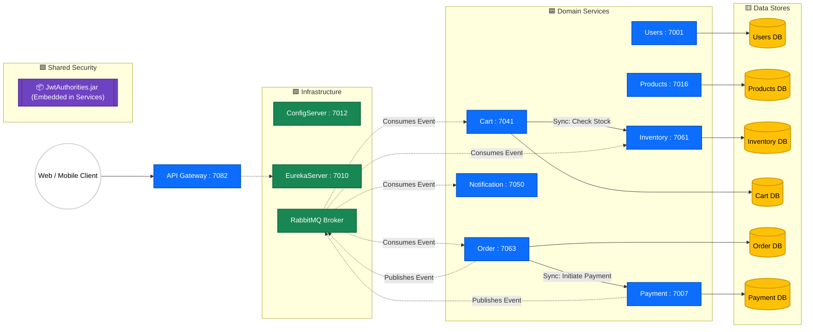
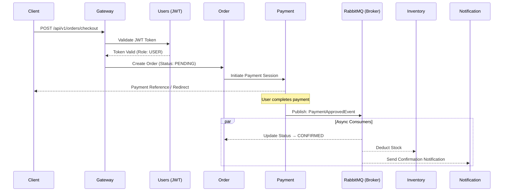

# 🛍️ ShopSphere: Distributed E-Commerce Microservices Platform


ShopSphere is an enterprise-grade, distributed e-commerce platform built on a reactive, event-driven architecture. Designed for high availability and elastic scalability, it demonstrates sophisticated patterns including distributed transactions (Saga), reactive data streams, and automated resilience engineering.

The platform is structured as independently deployable Spring Boot services with strict domain boundaries, a shared JWT utility library, and a fully automated CI pipeline.

---

## 🏗️ System Architecture

ShopSphere is built around three foundational architectural patterns: the **API Gateway Pattern** for a unified entry point, **Service Discovery** via Eureka for dynamic routing, and the **Database-per-Service Pattern** to enforce domain isolation and independent scalability.



### 📊 Diagram Legend

| Shape & Color | Node Type | Description |
| :--- | :--- | :--- |
| ⚪ **White Circle** | **External Actor** | End-user client (Web / Mobile App) |
| 🟦 **Blue Rectangle** | **Domain Service** | Independent microservice handling core business logic |
| 🟩 **Green Rectangle** | **Infrastructure** | Backbone services for routing, config, and messaging |
| 🟨 **Yellow Cylinder** | **Data Store** | Isolated persistence layers (Database-per-Service) |
| 🟪 **Purple Box** | **Shared Library** | Reusable `.jar` dependency embedded at compile time |

**Communication Lines:**
- `───▶` **Solid Arrow:** Synchronous HTTP/REST call (blocking)
- `- - -▶` **Dashed Arrow:** Asynchronous event-driven message (non-blocking)

---

## 🔄 Checkout Transaction Lifecycle

A single checkout triggers a coordinated distributed transaction across multiple services. The sequence below illustrates both the synchronous and asynchronous phases.



---

## 🛡️ Resilience & Observability

ShopSphere is built with a **"Design for Failure"** mindset. The API Gateway acts as the resilient edge using:

- **Circuit Breakers (Resilience4J):** Protects high-risk downstream routes.
  - **Trip Logic:** Circuit opens if failure rate exceeds **50%** over a rolling window of **10 calls**.
  - **Self-Healing (Half-Open):** After a **10-second cooldown**, **3 probe requests** are allowed through. Sustained success closes the circuit; further failures trip it open again.
- **Time Limiting:** **5-second hard timeouts** prevent a slow downstream service from exhausting the Gateway's thread pool.
- **Global CORS:** Pre-configured for modern frontend clients (e.g., React on port 3000).
- **Observability:** Spring Boot Actuator exposes real-time health checks and metrics on every service.

---

## 📦 Service Registry

| Service | Responsibility | Port |
| :--- | :--- | :---: |
| **Gateway** | API entry point, routing, edge resilience | `7082` |
| **ConfigServer** | Centralized configuration management | `7012` |
| **EurekaServer** | Service registration and dynamic discovery | `7010` |
| **Users** | Registration, login, and session management | `7001` |
| **Products** | Product catalog and category metadata | `7016` |
| **Inventory** | Stock tracking and safety-threshold management | `7061` |
| **Cart** | Add, view, and clear cart operations | `7041` |
| **Order** | Checkout orchestration and order retrieval | `7063` |
| **Payment** | Payment initiation, approval, and history | `7007` |
| **Notification** | Multi-channel dispatch (Email / SMS) via RabbitMQ | `7050` |
| **JwtAuthorities** | **[Library]** Shared JWT parsing and security filters | `N/A` |

---

## 📁 Repository Structure

```text
shopsphere-microservices/
├── ConfigServer/
├── EurekaServer/
├── Gateway/
├── JwtAuthorities/         ← Shared security library
├── Users/
├── Products/
├── Inventory/
├── Cart/
├── Order/
├── Payment/
├── Notification/
├── docker-compose.yml
└── pom.xml                 ← Multi-module Maven root
```

---

## 🚀 Local Development Setup

### Prerequisites

- Java 17
- Maven 3.9+
- Docker Desktop

### Step 1 — Start infrastructure dependencies
```bash
docker-compose up -d
```

### Step 2 — Install the shared JWT library
`JwtAuthorities` is a custom internal library that must be installed to your local `.m2` repository before building anything else:
```bash
mvn -pl JwtAuthorities -am clean install
```

### Step 3 — Build all modules
```bash
mvn clean package -DskipTests
```

### Step 4 — Start infrastructure services
```bash
mvn -pl ConfigServer spring-boot:run
mvn -pl EurekaServer spring-boot:run
mvn -pl Gateway spring-boot:run
```

### Step 5 — Start domain services
```bash
mvn -pl Users spring-boot:run
mvn -pl Products spring-boot:run
mvn -pl Inventory spring-boot:run
mvn -pl Cart spring-boot:run
mvn -pl Order spring-boot:run
mvn -pl Payment spring-boot:run
mvn -pl Notification spring-boot:run
```

> **Tip:** Services register themselves with Eureka on startup. The Gateway resolves routes dynamically — no hardcoded IPs needed.

---

## ⚙️ CI Pipeline

GitHub Actions runs on every push and pull request targeting `main`.

**Workflow location:** `.github/workflows/ci.yml`

| Step | Action |
| :--- | :--- |
| 1 | Checkout repository |
| 2 | Set up JDK 17 (Temurin distribution) |
| 3 | Build shared `JwtAuthorities` library |
| 4 | Run full Maven build with `clean verify` |
| 5 | Execute all unit and integration tests |
