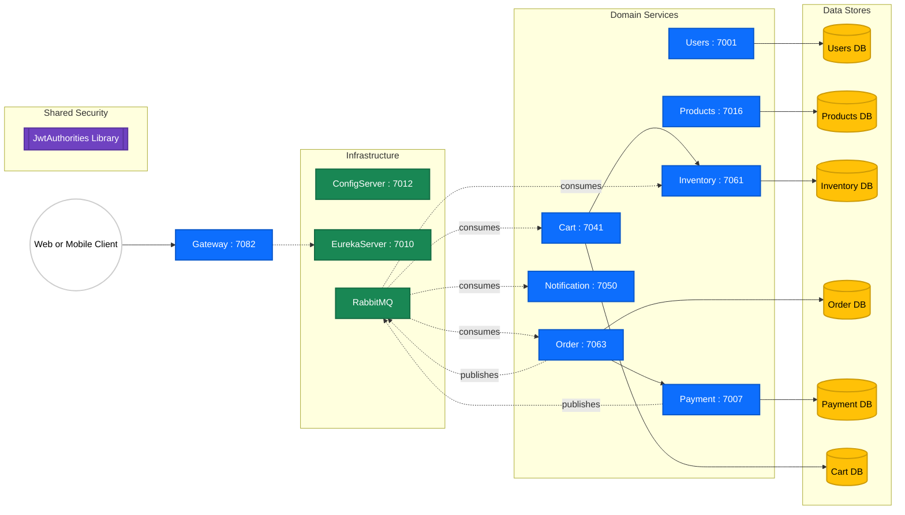
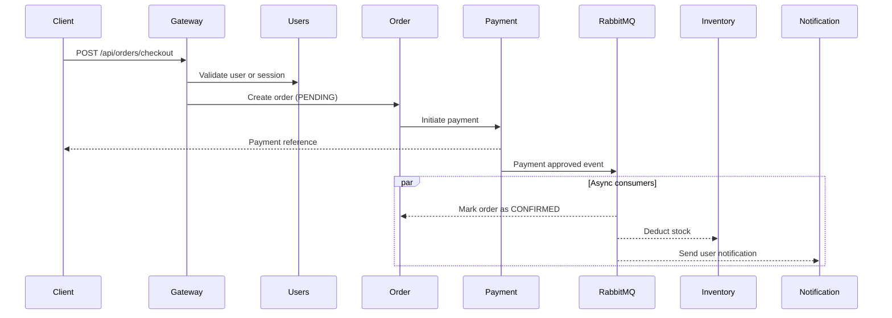

# ShopSphere: Distributed E-Commerce Microservices Platform


ShopSphere is a Java microservices backend inspired by the same architecture style as the reference ecosystem: gateway-first routing, centralized configuration, service discovery, and asynchronous integration through messaging.

The project is structured as independent Spring Boot services with clear domain boundaries and a reusable JWT utility library.

---

## System Architecture

ShopSphere uses the API Gateway pattern, service discovery, and service-per-domain boundaries for scalability and loose coupling.



---

## Checkout Lifecycle

The sequence below shows a typical order flow with both synchronous and asynchronous steps.



---

## Reliability and Operations

- Gateway includes circuit-breaker support for critical routes.
- Services expose Spring Boot Actuator endpoints for health and diagnostics.
- RabbitMQ dependencies are in place for event-driven communication between services.
- Each service is independently runnable and deployable.

---

## Service Registry

| Service | Responsibility | Port |
| :--- | :--- | :--- |
| Gateway | API entrypoint, routing, edge resilience | 7082 |
| ConfigServer | Centralized configuration source | 7012 |
| EurekaServer | Service discovery registry | 7010 |
| Users | Registration and login endpoints | 7001 |
| Products | Product and category catalog endpoints | 7016 |
| Inventory | Stock and safety-threshold management | 7061 |
| Cart | Add or view or clear cart operations | 7041 |
| Order | Checkout and order retrieval endpoints | 7063 |
| Payment | Payment initiation, approval, and status | 7007 |
| Notification | Multi-channel notification dispatch | 7050 |
| JwtAuthorities | Shared JWT parsing utility library | N/A |

---

## Repository Structure

```text
Microservices/
  ConfigServer/
  EurekaServer/
  Gateway/
  JwtAuthorities/
  Users/
  Products/
  Inventory/
  Cart/
  Order/
  Payment/
  Notification/
  docker-compose.yml
  pom.xml
```

---

## Local Development Setup

### 1) Prerequisites

- Java 17
- Maven 3.9+
- Docker Desktop

### 2) Start dependencies

```bash
docker-compose up -d
```

### 3) Build shared JWT library first

```bash
mvn -pl JwtAuthorities -am clean install
```

### 4) Build all modules

```bash
mvn clean package -DskipTests
```

### 5) Start infrastructure services

```bash
mvn -pl ConfigServer spring-boot:run
mvn -pl EurekaServer spring-boot:run
mvn -pl Gateway spring-boot:run
```

### 6) Start business services

```bash
mvn -pl Users spring-boot:run
mvn -pl Products spring-boot:run
mvn -pl Inventory spring-boot:run
mvn -pl Cart spring-boot:run
mvn -pl Order spring-boot:run
mvn -pl Payment spring-boot:run
mvn -pl Notification spring-boot:run
```

---

## CI Pipeline

GitHub Actions is configured to run on push and pull requests to main.

Workflow location:

- .github/workflows/ci.yml

Pipeline steps:

1. Checkout repository
2. Set up JDK 17 (Temurin)
3. Run Maven build and tests with clean verify
