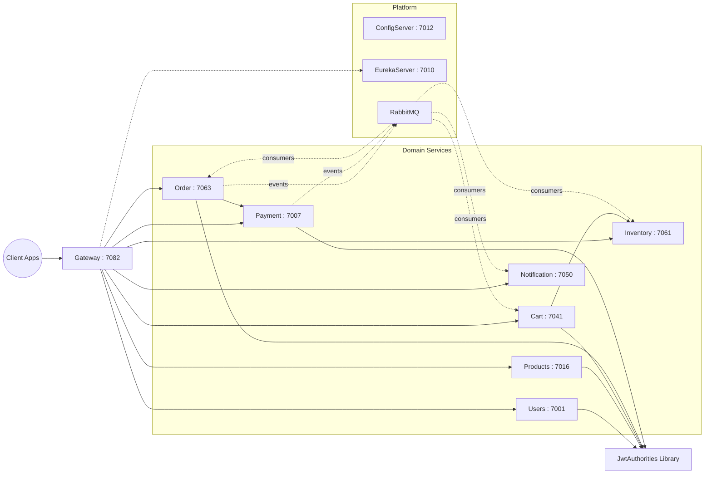

# ShopSphere


ShopSphere is a microservices-first e-commerce backend designed as an engineering portfolio project with production-minded architecture decisions.

The goal is not only to expose endpoints, but to demonstrate how systems evolve from simple service boundaries to resilient, observable, event-driven workflows.

## About This Repository

This repository is intentionally opinionated for senior-level review:

- Clear service boundaries and responsibility ownership.
- Gateway plus discovery plus centralized config as foundational platform patterns.
- Event-driven extension points using RabbitMQ-ready dependencies.
- CI pipeline that verifies build integrity on every push and pull request.
- Incremental architecture: current implementation is intentionally lightweight, with explicit upgrade paths to production-grade persistence and distributed concerns.

## Architecture Snapshot



## Service Catalog

| Service | Port | Primary Responsibility |
| :--- | :--- | :--- |
| ConfigServer | 7012 | Centralized configuration service |
| EurekaServer | 7010 | Service registry and discovery |
| Gateway | 7082 | Routing, edge control, resilience boundary |
| Users | 7001 | User registration and login workflows |
| Products | 7016 | Product and category catalog APIs |
| Inventory | 7061 | Stock tracking and safety-threshold operations |
| Cart | 7041 | Cart lifecycle: add, view, clear |
| Order | 7063 | Checkout and order query flows |
| Payment | 7007 | Payment initiation, approval, status tracking |
| Notification | 7050 | Multi-channel notification dispatch |
| JwtAuthorities | N/A | Shared JWT claims and header parsing utility |

## Engineering Decisions and Trade-Offs

- Domain-first service decomposition over premature optimization.
- Synchronous calls for immediate business needs, asynchronous paths for eventual consistency workflows.
- Lightweight in-memory service logic in early phase to accelerate boundary design and API iteration.
- Spring Cloud BOM alignment across modules to keep dependency management deterministic.
- CI-first workflow to catch integration issues before review.

## Current State and Next Iteration

Current baseline:

- Multi-module Maven project with independent Spring Boot services.
- Centralized discovery and gateway edge.
- RabbitMQ integration points present.
- GitHub Actions CI enabled.

Next engineering targets:

- Replace in-memory stores with per-service persistence and migrations.
- Add distributed tracing and correlation IDs.
- Introduce contract tests between critical service boundaries.
- Harden auth flow with token refresh and permission checks at gateway and service layers.
- Add deployment manifests and environment profiles for staging and production.

## Local Development

Prerequisites:

- Java 17
- Maven 3.9+
- Docker Desktop

Start dependencies:

```bash
docker-compose up -d
```

Build shared library:

```bash
mvn -pl JwtAuthorities -am clean install
```

Build all modules:

```bash
mvn clean verify
```

Run infrastructure:

```bash
mvn -pl ConfigServer spring-boot:run
mvn -pl EurekaServer spring-boot:run
mvn -pl Gateway spring-boot:run
```

Run domain services:

```bash
mvn -pl Users spring-boot:run
mvn -pl Products spring-boot:run
mvn -pl Inventory spring-boot:run
mvn -pl Cart spring-boot:run
mvn -pl Order spring-boot:run
mvn -pl Payment spring-boot:run
mvn -pl Notification spring-boot:run
```

## CI

Pipeline file: `.github/workflows/ci.yml`

CI workflow performs:

1. Checkout
2. JDK 17 setup (Temurin)
3. `mvn -B -ntp clean verify`

## Reviewer Notes

If you are reviewing this as a senior engineer, the most valuable feedback areas are:

- Boundary choices between services.
- Event contract design and failure semantics.
- Upgrade path from current baseline to production-readiness.
